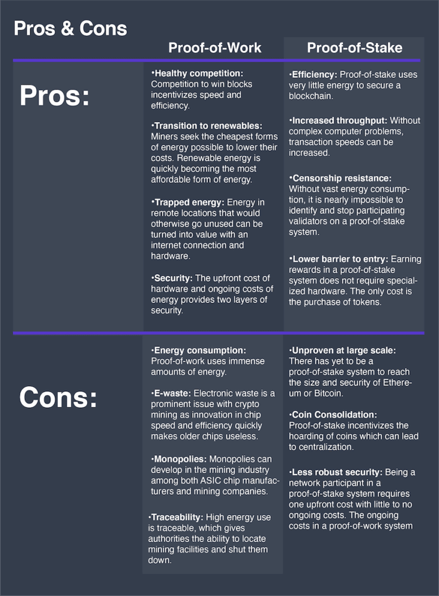

# Proof of work(POW) vs Proof of Stake(POS)

_Contributed By: Siddharth Choudhury_  
_Dated: Mar 30, 2022_

Proof of work and proof of stake are two blockchain consensus models that are used to ensure the validity of transactions in cryptocurrency trading. Proof of work involves solving complex cryptographic mathematical equations using computing power. In contrast, proof of stake miners stake their digital coins for the right to validate new block transactions.

### Proof of Work(POW)
- proof of work (POW), cryptocurrency miners compete against each other to solve a complex problem using high-powered computers. Those first to do so are given the authority to add the new block of transactions and then rewarded with digital currency for their work. When a block is authenticated, it’s added to the blockchain.
- Proof of work requires increasingly fast computers, the use of significant energy resources, and processes that eventually slow down transaction times as a cryptocurrency network grows. 

### Proof of Stake(POS)

- With proof of stake (POS), miners have to pledge a "stake" of digital currency before they can validate transactions. A miner’s capacity to validate blocks depends on how many coins they have put up for stake and how long they have been validating transactions. The more coins they own, the more power they have for mining. The miner chosen for each transaction is chosen randomly through a weighted algorithm that takes the miners' relative power into account.
- Proof of stake was developed as an alternative to proof of work because of concern about how much energy proof of work uses, its environmental impact, its vulnerability to attacks, and questions about its scalability.

 

Reference

- [Proof of Work](https://www.youtube.com/watch?v=532h36VJ7XE)
- [Proof of Stake](https://www.youtube.com/watch?v=tyroSaq2OC4)

